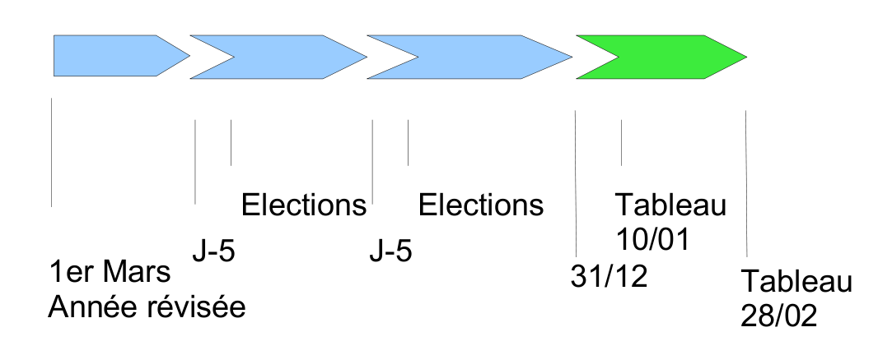

.. _avant_de_commencer:

##################
Avant de commencer
##################

**************************************
Les droits et profils des utilisateurs
**************************************
  
Chaque utilisateur est associé à un profil. Le profil est le niveau de droits
de l'utilisateur, dans la configuration par défaut d'openElec, il existe cinq
profils :

#. Consultation,

#. Utilisateur limité,

#. Utilisateur,

#. Super utilisateur,

#. Administrateur.

Chaque page de l'application est associée à un profil. Pour chaque accès à une
page, l'application vérifie si l'utilisateur a un profil supérieur ou égal au
profil de la page consultée, si c'est le cas l'utilisateur à donc le droit
d'accéder aux informations.

******************
L'année électorale
******************

    Année électorale

*****************
La liste en cours
*****************

A quoi sert cette liste ?
=========================

Il existe dans le système électoral trois listes : la liste générale, la liste
européenne, la liste municipale européenne. Les citoyens de l'Union européenne
qui souhaitent s'inscrire sur les listes doivent le faire à la mairie de leur
domicile sur une liste électorale complémentaire. Il existe deux listes
électorales complémentaires distinctes, l'une valable pour les élections
municipales, l'autre valable pour les élections européennes.

openElec travaille sur une seule liste à la fois en ce qui concerne les
inscriptions, radiations, modifications, traitements, éditions, ... Il faut
donc selon le besoin savoir sur quelle liste on travaille, et comment on
change de liste.

Consulter la liste en cours
===========================

Cette information est en permanence affichée à l'écran, sur la droite, en haut
de la page à côté du login. Cela permet de savoir en un coup d'oeil sur quelle
liste on est en train de travailler.

.. figure:: liste_en_cours.png

    Liste en cours

Modifier la liste en cours
==========================

Pour modifier la liste, il suffit de cliquer sur la liste. Une liste de choix
nous permet de sélectionner la liste sur laquelle on veut travailler. 

.. _la_date_de_tableau:

******************
La date de tableau
******************

A quoi sert cette date ?
========================

La date de tableau est la date à laquelle sera effectuée le prochain
traitement. Elle permet lors de la saisie de mouvements de lier ce mouvement
à un traitement. Il ne peut y avoir qu'une seule date de tableau à la fois soit :

* le tableau du 10 janvier, qui concerne l'ensemble des mouvements (inscriptions, modifications, radiations)

* le tableau du 28 février. qui concerne (généralement) les mouvements de modifications

Consulter la date tableau
=========================

Pour consulter la date tableau, il suffit d'accéder au tableau de bord de l'application. La date de tableau y est affichée.

.. figure:: consultation_de_la_date_de_tableau.png

    Consultation de la date de tableau

Modifier la date tableau
========================

Pour modifier la date de tableau en cours, il suffit de cliquer sur la date de tableau affichée sur le tableau de bord, de la modifier et ensuite valider la modification.

.. figure:: modifier_la_date_de_tableau.png

    Modifier la date de tableau
