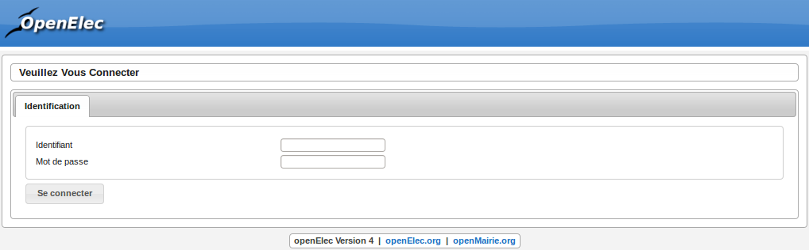

#########
Connexion
#########

.. note::

   Pour réaliser cette étape, votre administrateur doit vous fournir une
   adresse Web pour accéder à l'application, un identifiant utilisateur ainsi
   qu'un mot de passe. Ces éléments auront été préalablement configuré dans
   le logiciel.

==============
Navigateur Web
==============

L'application est accessible via un navigateur Web, pour y accéder il faut
saisir l'adresse Web fournie par votre administrateur dans la barre d'adresse.

.. figure:: connexion_navigateur.png

    Saisie d'adresse dans un navigateur Web

.. note::

    Ce logiciel est développé principalement sous le navigateur Mozilla Firefox,
    il est donc conseillé d'utiliser ce navigateur pour une efficacité optimale.

====================================
Saisie des informations de connexion
====================================

Cet écran de connexion est composé de deux zones de texte et d'un bouton.

    Formulaire de connexion

La figure 2 présente l'écran d'identification, il faut saisir son identifiant et
son mot de passe puis cliquer sur le bouton « Se connecter ».

.. note::

    L'identifiant et le mot de passe doivent être saisis en respectant la
    casse, c'est-à-dire les minuscules et majuscules.

Connexion échouée
-----------------

Si les identifiants saisis sont incorrects, un message d'erreur apparaît et il
faut ressaisir les informations de connexion.

.. figure:: connexion_message_erreur.png

    Message de connexion échouée

Connexion réussie
-----------------

Si les identifiants sont corrects, vous êtes redirigé vers la page demandée sur
laquelle le message suivant doit d'afficher.

.. figure:: connexion_message_ok.png
    
    Message de connexion réussie
