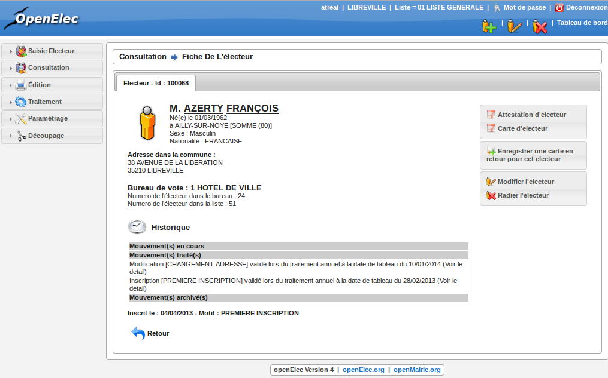

.. _consultation:

############
Consultation
############

Généralités
-----------

La rubrique consultation vous permet de consulter les listes suivantes :

   * electorale,
   * archive,
   * inscription,
   * radiation,
   * modification,
   * procuration,
   * centre de vote,
   * mairie Europe,
   * inscription office INSEE,
   * radiation INSEE,
   * traces et editions.

Pour chaque liste, vous disposez d'une fonction de recherche permettant
de trouver un électeur par son prénom, nom, sa date de naissance ou même son identifiant openElec.

Lorsque cela est possible vous trouverez également à gauche de chaque
élément de la liste des boutons permettant de réaliser diverses actions,
comme l'ajout d'un nouvel électeur, la modification, la suppresion ou
encore l'édition de son attestation d'inscription

.. figure:: consultation.png

    Liste des électeurs : Centre de vote

Consultation de la fiche de l'électeur
---------------------------------------

Lorsque vous effectuez une recherche d'électeur par le menu Consultation - Liste électorale, il est possible, en cliquant sur le nom de l'électeur d'accéder à sa fiche.
Cette fiche regroupe l'ensemble des informations concernant l'électeur (état civil, adresse, bureau de vote), l'historique des mouvements appliqués et/ou en cours. 
Il vous ai aussi possible d'imprimer sa carte d'électeur, une attestation, effectuer un retour de carte mais aussi saisir un mouvement (radiation, modification)

     Consultation fiche d'un électeur
