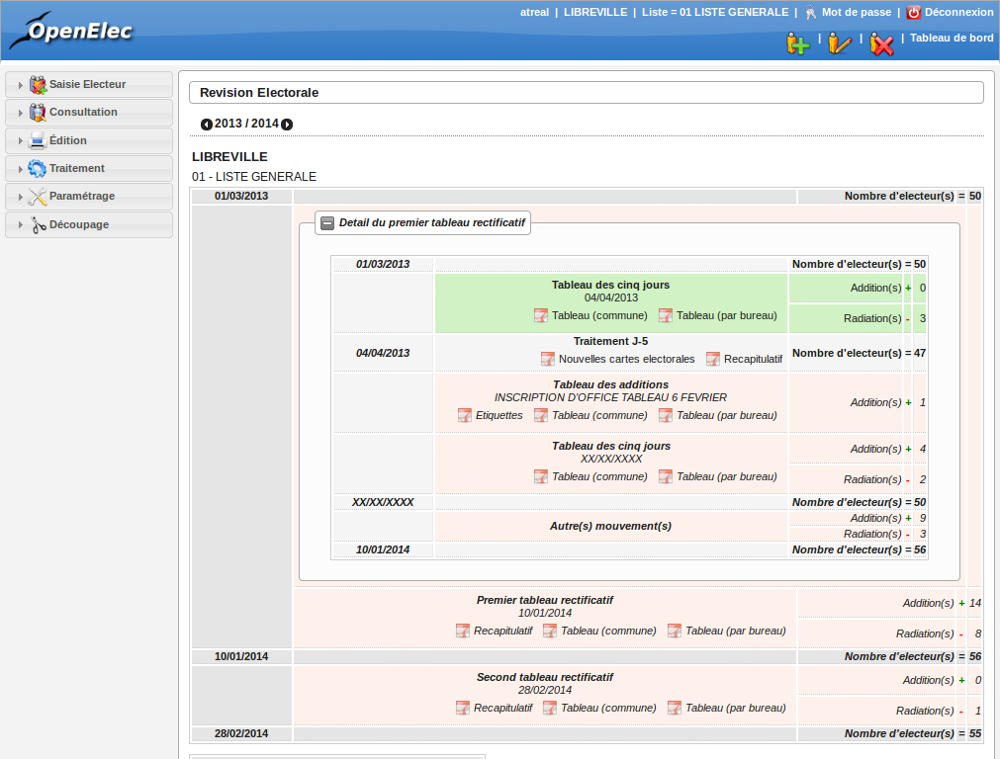
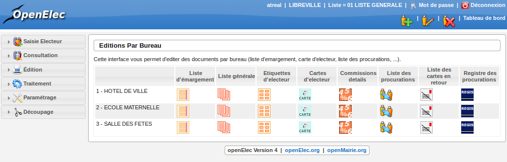
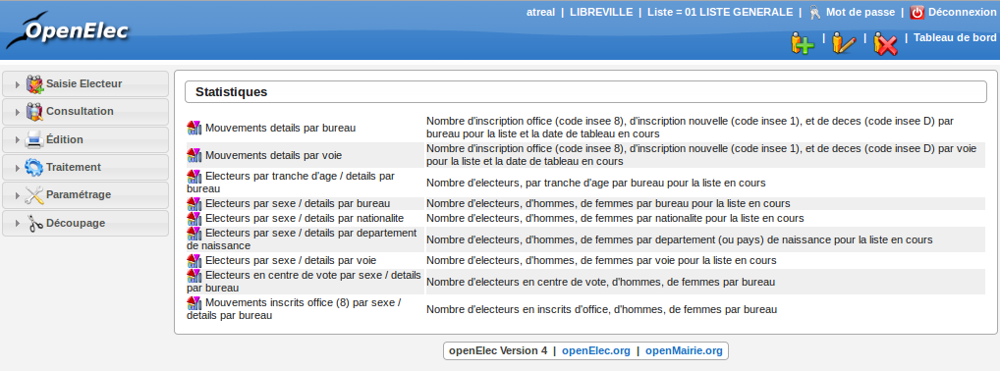
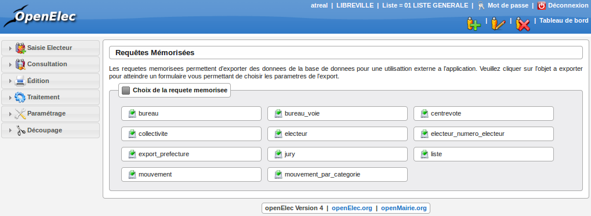

.. _editions:

########
Editions
########

Révision électorale
-------------------

Le tableau de révision électorale vous donne accès à l'ensemble des informations électorales de l'année en cours mais aussi des années précédentes (en cliquant sur les fiches . Pour chaque traitement effectués, vous pouvez éditer l'ensemble des éditions qui concernent les mouvement effectués (tableau rectificatif pour la commune et par bureau, les cartes des nouveaux électeurs...)
En fond vert, les traitement effectués au cours de l'année électorale, en fond rose les traitements à venir.

    Tableau de révision électorale

Editions par bureau
-------------------

.. note::

   Avant d'éditer les listes d'émargements, il vous faudra appliquer les mentions (procurations, centres de vote, mairie Europe), pour ce faire, rendez-vous au menu "traitement-Election"

Le menu Editions par bureau va vous permettre d'éditer l'ensemble des éditions nécessaires au bon déroulement d'une élection.

     Editions par bureau

Editions générales
------------------
Le menu Editions Générales va vous permettre d'éditer la liste électorale, les cartes d'électeurs, les statistiques généraux, le registre général des procurations, la liste des électeurs inscrits en centre de vote et les étiquettes des électeurs

.. figure:: edition_generales.png

     Editions générales

Editions Statistiques
---------------------

Le menu Editions statistiques vous permet d'éditer l'ensemble des statistique demandé par La préfecture. Si toutefois vous avez besoin de statistiques complémentaires, vous pour utiliser les exports CSV, à partir du menu Requêtes mémorisées.

     Editions statistiques

Requêtes mémorisées
-------------------

Le menu requêtes mémorisées va vous permettre d'exporter la base électorale afin de vous en servir dans un tableur (excel, openOffice, LibreOffice...). 

     Requêtes memorisées

Prenons un exemple : vous souhaitez sortir l'ensemble de liste électorale sur votre tableur : Cliquez sur "Liste", décochez ou pas les éléments de votre liste, puis dans la partie "paramètre de sortie" choisissez "CSV - export vers le logiciel tableur", puis cliquez sur le bouton "exécuter la requête mémorisée sur liste". 

.. figure:: edition_sortie_csv.png

     Sortie CSV

