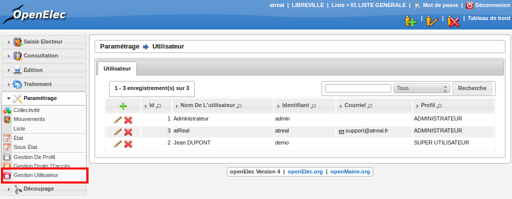
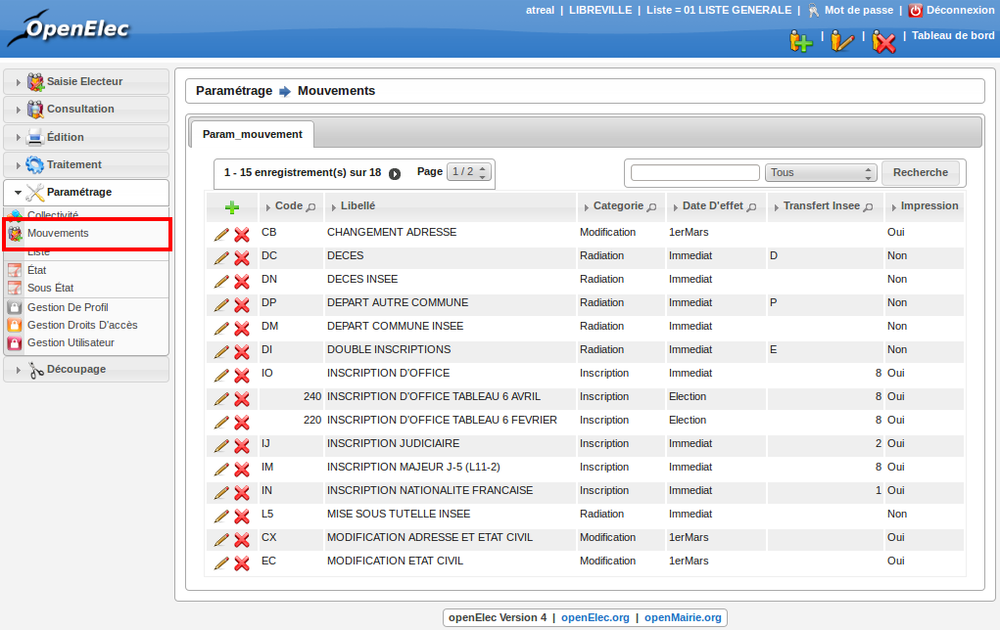
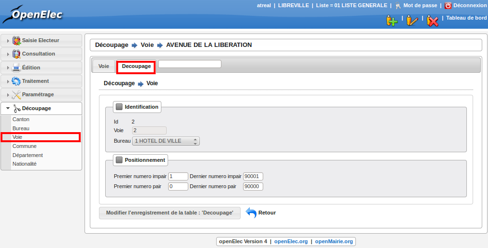

.. _parametrage:

###########
Paramétrage
###########

Tous les paramétrages se font par l’intermédiaire de formulaires. Dans
l’optique openMairie, l’application présente un tableau permettant de choisir
l’enregistrement à modifier ou à supprimer, ou de créer un nouvel
enregistrement. Les éléments paramétrables sont : mouvement, collectivite,
numérotation bureau, liste, communes, départements, nationalités, utilisateur,
profil, droit.

Gestion des utilisateurs
========================

Ce paramétrage permet de créer, modifier ou supprimer des utilisateurs.

    Rubrique Parametrage : Gestion Utilisateur

En effet, pour ajouter un nouvel utilisateur, il suffit de cliquer sur
l'icone + en haut à gauche du tableau, pour obtenir un formulaire
d'insertion. En cliquant sur l'icone supprimer devant l'utilisateur,
on obtient un formulaire de suppression. Et enfin en cliquant sur le
nom de l'utilisateur, on obtient un formulaire de modification.

Paramétrage des mouvements
==========================

Ce paramétrage est très important, il permet de régler les catégories et les
paramètres des mouvements. ces paramètres sont les suivants : le type de
catégorie, l'effet immédiat (j-5) ou 1er Mars (annuel), le transfert ou
non au CNEN, si la carte d'électeur doit être imprimé à la suite de ce
mouvement ou non. L'ajout, modification ou suppression de ces paramètres se
fait de la même manière que le paramétrage des utilisateurs.

    Rubrique Parametrage : Mouvements

Découpage
=========

Le découpage inclut plusieurs notions: le canton, le bureau, la voie.
Chaque bureau appartient à un canton, et chaque voie appartient à un bureau
d'un numéro de cette voie à un autre numéro. Cela permet lorsque toutes les
voies sont correctement saisies d'affecter un électeur à son bureau en
fonction de son adresse.

Les trois paramétrages sont identiques aux paramétrages vus précédemment :
ajout, suppression, modification.

Seule l'association de voies à un bureau est légèrement différente comme on
peut le voir sur la figure suivante. Lorsque l'on modifie, une voie on peut
visualiser un tableau supplémentaire qui associe cette voie à un bureau.
En cliquant sur le + on ajoute, une association (ex : rue de la république
du n°1 à 500 => bureau 1, du n°501 à 1000 > bureau 2), on peut modifier ou
supprimer comme tous les paramétrages précédents.

    Rubrique Decoupage : Voie
