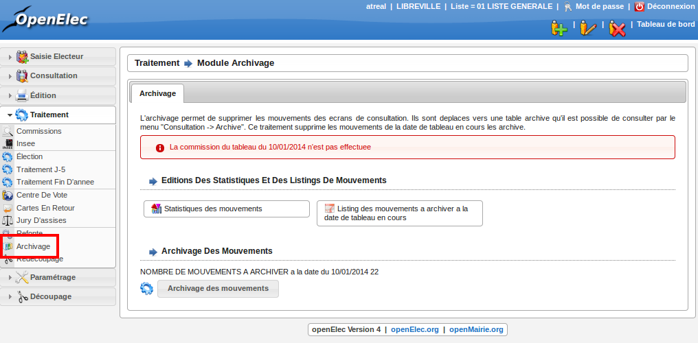

################
Module Archivage
################

Préambule
---------

L'archivage permet de supprimer les mouvements des écrans de consultation.
Ils sont déplacés vers une table archive qu'il est possible de consulter
depuis la rubrique " Consultation -> Archive ". Ce traitement supprime
les mouvements de la date de tableau en cours et les archive.

    Ecran du module : Archivage

Réaliser l'archivage
--------------------

L'archivage se fait une fois le traitement de fin d'année effectué. Cela
permettra  d'archiver les mouvements de l'année précédente.

Tout d'abord imprimez les éditions proposées :

* statistiques des mouvements.
* listing des mouvements à archiver à la date de tableau en cours.

Puis confirmez l'archivage.

Attention : l'archivage se fait uniquement sur la liste sur laquelle vous êtes
en train de travailler. Pour archiver les mouvements sur les deux autres
listes, changer de liste et procéder de la même manière.
