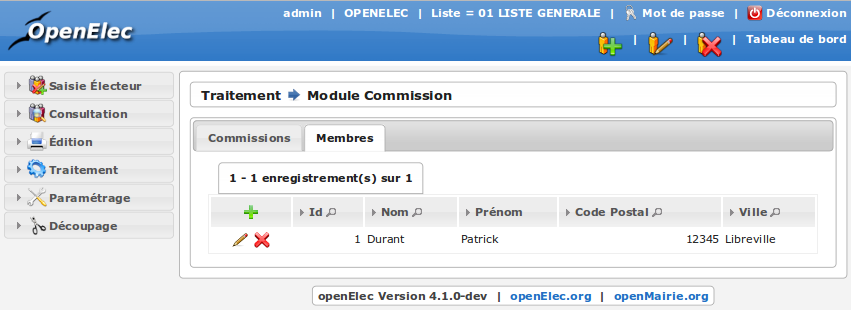
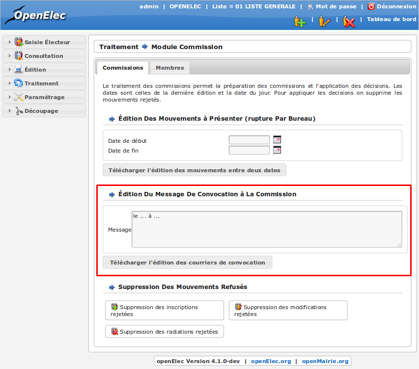
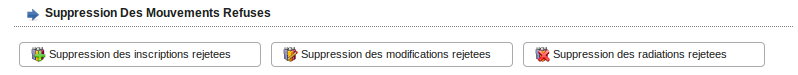

##################
Module Commissions
##################

Préambule
=========

La commission se réunit de septembre à décembre. Lors des séances de la
commission, les demandes de mouvements sont présentées avec leurs
justificatifs. La commission statue sur chaque demande et l’accepte ou
la rejette. A la fin de la séance, la feuille de présentation corrigée
est signée et conservée à titre d’archives.

Pré-requis pour utiliser le module Commissions :

    * l’utilisateur qui effectue le travail de préparation de la commission doit avoir le droit " administrateur ".

    * les mouvements (inscriptions, modifications, radiations) doivent avoir été préalablement saisis dans openElec.

    * on doit connaître la date de la dernière commission.

Editions préparatoire, de septembre à décembre
==============================================

La préparation de la commission se fait la veille de celle-ci.
L’édition préparatoire des mouvements pour la commission se fait
via le menu " Traitement / Commissions ".

Dans le cadre " Edition Des Mouvements A Presenter (rupture Par Bureau) " :

    * saisir dans la " Date de début " la date suivant la date de fin de la précédente édition.
    * saisir dans la " Date de fin " la date du dernier jour cloturé précédent la commission. Ne jamais saisir une journée en cours : des mouvements ne seraient pas présentés en commission !
    * cliquer sur le lien " Telecharger l'edition des mouvements entre deux dates ". Imprimer le résultat.

.. figure:: module_commission.png

    Écran du module : Commissions

Saisie des membres de la commission
===================================

    Membres des commissions

Il permet la saisie du nom, prénom et adresse des membres.

Convocation des membres à la commission
=======================================

Une fois les membres saisie il est possible de générer un fichier au format pdf contenant un courrier de convocation pour chacun d'eux.

    Édition du courrier de convocation

Séance de travail de la commission
==================================

Les trois éditions sont présentées à la commission, accompagnées des
éléments justificatifs. Durant la séance, la commission décide de
valider ou rejeter le mouvement. Lorsque le mouvement est rejeté, il
est rayé de la liste, avec en commentaire le motif. Les listes
modifiées sont signées par la commission.

Application des décisions de la commission
==========================================

Les mouvements refusés par la commission doivent être supprimés
d’openElec. Pour chaque mouvement rejeté, il faut effectuer la recherche
du mouvement dans son tableau, éventuellement éditer le courrier de refus du mouvement
puis le supprimer manuellement.

Vous pouvez accédez respectivement aux tableaux des mouvements
d'inscription, de modification et de radiation directement
depuis l'écran du module de commission.

    Raccourci d'accès aux mouvements

Une fois l'électeur concerné trouvé, cliquez sur la croix rouge à gauche
du mouvement pour supprimer ce dernier.

.. figure:: module_commission_mouvements.png

    Mouvements de modification
