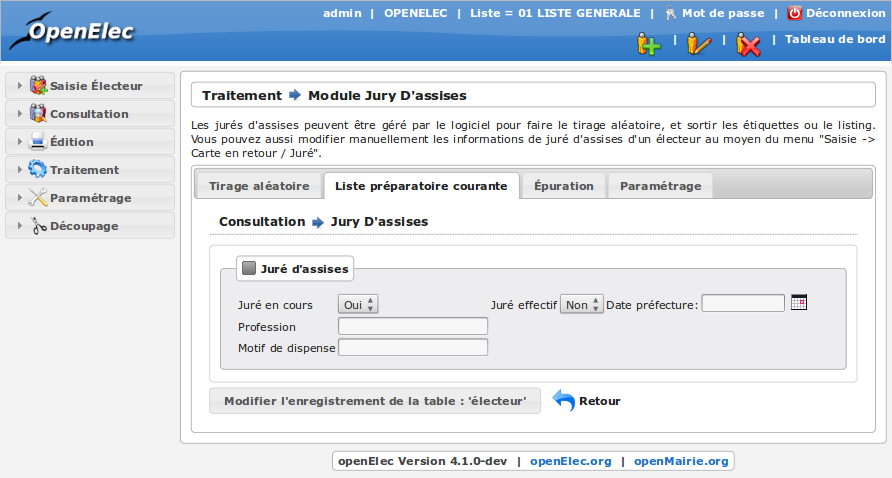

#####################
Module Jury d'Assises
#####################

Préambule
---------

Les jurés d'assises peuvent être gérés par le logiciel pour faire le tirage
aléatoire, et sortir les étiquettes ou le listing. Vous pouvez aussi modifier
manuellement les informations de juré d'assises d'un électeur directement
depuis la rubrique " Saisie -> Carte en retour / Jure ". 

.. figure:: module_jury_d_assises.png

    Ecran du module : Jury d'Assises

Paramétrer le nombre de jurés
-----------------------------

Pour cela, vous devez tout d'abord saisir le nombre de juré voulu pour chaque
tirage au sort. Par la suite ce nombre ne vous sera plus demandé.

Pour inscrire ce nombre de juré, cliquez sur l'onglet " Parametrage ", puis sur modifier (représenté par l'icone
de crayon) pour accéder au formulaire de modification.
Insérez le nombre de juré choisi et cliquez sur le bouton " Modifier "
pour enregistrer les changements.

.. figure:: module_jury_d_assises_parametrage_collectivite.png

    Rubrique Parametrage : Collectivite

Effectuer un tirage au sort
---------------------------

Pour tirer au sort le jury rendez-vous dans la rubrique " Traitement
/ Jury d'Assises " . Cliquez ensuite sur le bouton " Tirage aléatoire ".

Attention, être tiré au sort par la mairie ne signifie pas forcément
être membre du " jury d’assise " car une nouvelle
sélection a lieu au niveau de la préfecture :

* Contrôle de la profession.

* Lien de parenté avec l’accusé.

* Refus de la part de l’électeur.

Confirmer un membre du jury
---------------------------

Pour définir un électeur tiré au sort comme un membre effectif du jury,
rendez-vous dans la rubrique " Saisie " puis " Carte en retour / Juré ".
Recherchez l'électeur puis éditez sa fiche en cliquant sur le bouton
modifier (représenté par une icone de crayon).

Enfin remplissez la section " Juré d'assises ". Le champ " Date préfecture "
correspond à la date à laquelle la préfecture a donné son accord pour la
sélection de cet électeur.

    Rubrique Saisie : Carte en retour / Jure
