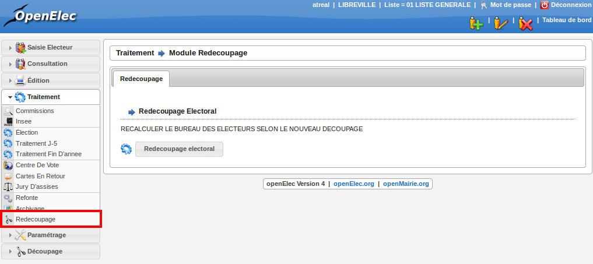

##################
Module Redécoupage
##################

Ce module est à manipuler avec précaution.
Lors d'une création d'un nouveau bureau de vote, ou lors d'une modification de découpage de voie, ce module permet d'effectuer automatiquement les mouvements de modifications sur les électeurs impliqués.
L'ensemble des mouvements de modification seront appliqués lors du prochain traitement annuel.
Pour appliquer le redécoupage, cliquer sur le bouton "Redécoupage Electoral", une fenêtre s'ouvre demandant la confirmation "êtes-vous sûr de vouloir confirmer cette action" cliquez sur OK si vous êtes sûr, sinon sur Annuler.

    Ecran du module : Redécoupage
