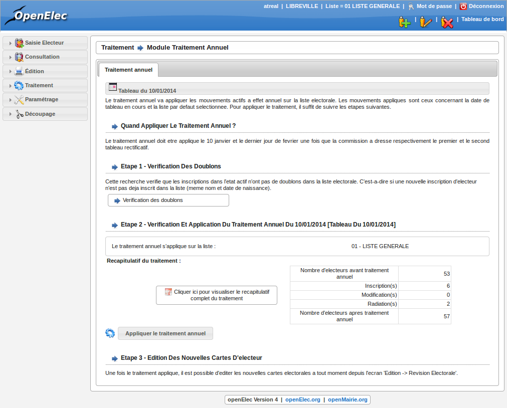

.. _traitements_module_traitement_annuel:

########################
Module Traitement Annuel
########################

Présentation
============

La commission se réunit entre le 1er et le 9 janvier pour statuer sur
l'ensemble des inscriptions, des radiations et des modifications de l'année.
Suite à ce travail, ses décisions seront appliquées dans la liste. Le tableau
du 10 janvier sera signé par les membres de la commission, et affiché en mairie
durant 10 jours. A la suite de cette période, il sera tenu à disposition des
électeurs de la commune au secrétariat. Une copie du tableau du 10 janvier
ainsi que du Procès Verbal constatant le dépôt et l'affichage du tableau sont
envoyés au sous-préfet, qui dispose de deux jours pour le faire parvenir au
préfet avec ses observations. (cf. Circulaire n° 60-352)

Éditions préalables à la commission
===================================

Les éditions entre deux dates sont présentées à la commission qui va statuer
sur l'ensemble des demandes. L'ensemble de ce travail est conforme à la
préparation de la commission, telle que cela a été vu précédemment. D'autre
part, l'édition des mouvements annuels par bureau sera aussi éditée. Pour
ce faire rendez-vous dans la rubrique " Edition / Révision électorale ".

.. figure:: module_traitement_fin_d_annee_edition_parbureau.png

    Rubrique Edition : Par bureau

La commission va effectuer son travail sur la base des éditions de mouvements
entre deux dates. Les éditions commission par bureau seront celles affichées et
transmises à la préfecture.

Validation du traitement du 10 janvier
======================================

Les traitements de validation sont accessibles depuis la rubrique
" Traitement / Traitement Fin D'annee ".

    Ecran du module : Traitement Annuel

Avant de confirmer le traitement, il faudra effectuer les éditions et
vérifications suivantes :

* Vérification des doublons

* Statistiques mouvements détail par bureau

* Listing des inscriptions

* Listing des modifications

* Listing des radiations

Enfin cliquez sur " Appliquer le traitement annuel " pour appliquer les mouvements dans
la liste active.

Édition des cartes des nouveaux électeurs
=========================================

Attention : Uniquement hors années de refonte !

Cliquez sur " Edition - Revision Electorale ". Ces éditions sont
effectuées sur les pré-imprimés prévus à cet effet.

Pour les années de refonte, les cartes des électeurs seront éditées après
refonte.

Clôture du traitement du 10 janvier
===================================

Les traitements sont terminés. On modifie alors la date du prochain tableau
pour la passer au 28 février de l'année en cours. Cela se fait à partir du tableau de bord, il suffit de cliquer sur la date de tableau et la changer.

.. figure:: module_traitement_fin_d_annee_parametrage_tableau.png

    Rubrique Parametrage : Collectivite

Cliquez sur le bouton modifier (représenté par l'icone de crayon) pour
accéder au formulaire d'édition de la collectivité. Remplacez la date
de tableau puis valider à l'aide du bouton " Modifier ".

Cette procédure de traitement de fin d'année s'applique également au
tableau du 28 février.
