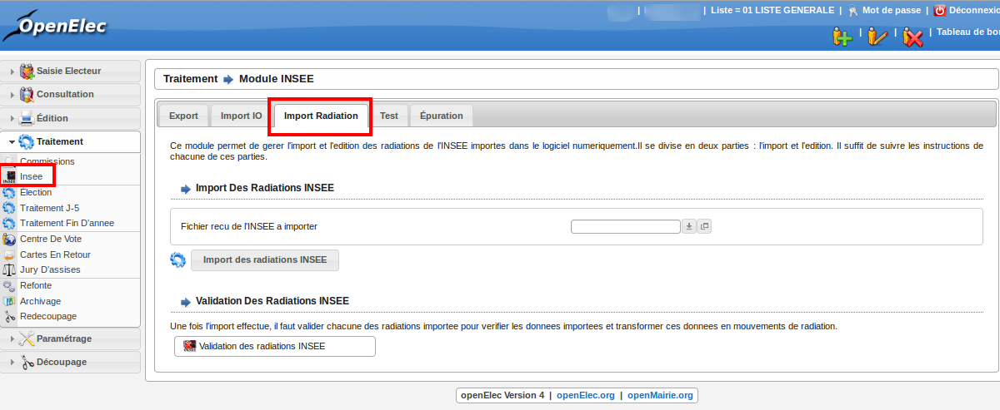

############
Module INSEE
############

Inscription d'office INSEE
==========================

Import du fichier provenant de l'INSEE
--------------------------------------

Vous allez recevoir de l'INSEE un CD-ROM avec un fichier d'électeurs
d'inscrits d'office. Ce fichier sera au format TXT. Le module INSEE
vous permet d'importer les données de ce fichier dans votre base
openElec.

Premièrement rendez-vous dans la rubrique " Traitement / Insee "
onglet " Import IO ".

.. figure:: module_insee_import_io.png

    Ecran du module : INSEE - Import OI

A l'aide du champ " Fichier reçu de l'INSEE à importer " sélectionnez
un fichier à importer. Validez en cliquant sur " Import des inscriptions
d'office INSEE ".

Création des mouvements d'inscription
-------------------------------------

Vous pouvez maintenant retrouver la liste des nouveaux inscrits d'office
dans la rubrique " Consultation / Inscription Office INSEE ". Il faut
à présent valider chaque inscrit manuellement pour créer les mouvements
d'inscription correspondant.

Pour cela, cliquez sur le bouton précédant chaque nom, vous accéderez alors
à la fiche d'inscription de l'électeur correspondant. Le champ " observation "
contient l'adresse de l'électeur qu'il vous faudra copier dans le groupe
de champs " Adresse " de la fiche. Enfin indiquez le type de mouvement.

Une fois ces informations saisies, vous n'avez plus qu'à valider
ce mouvement en cliquant sur le bouton " Ajouter ".

Import Radiations INSEE
==========================

Import du fichier provenant de l'INSEE
--------------------------------------

Vous allez recevoir de l'INSEE un CD-ROM avec un fichier d'électeurs
a radier. Ce fichier sera au format TXT. Le module INSEE
vous permet d'importer les données de ce fichier dans votre base
openElec.

Premièrement rendez-vous dans la rubrique " Traitement / Insee "
onglet " Import Import Radiation ".

    Ecran du module : INSEE - Import OI

A l'aide du champ " Fichier recu de l'INSEE a importer " sélectionnez
un fichier à importer. Validez en cliquant sur " Import des radiations INSEE ".

Création des mouvements de radiation
-------------------------------------

Vous pouvez maintenant retrouver la liste des électeurs à radier
dans la rubrique " Consultation / Radiations ". Il faut
à présent valider chaque radiation manuellement pour créer les mouvements
de radiation correspondant.

Une fois ces informations saisies, vous n'avez plus qu'à valider
ce mouvement en cliquant sur le bouton " Ajouter ".

Export INSEE
============

L'export INSEE vous permet de créer un fichier texte pour transférer à
l'INSEE tous les mouvements concernant la date de tableau en cours et
paramètres pour un export dans le paramétrage des mouvements.

Pour ce faire, allez dans la rubrique " Traitement / Insee ".

Si vous avez déjà effectué votre traitement de fin d'année et changé la date
de tableau, il vous faudra modifier la date de tableau. (Exemple, vous venez
d'effectuer le traitement au 10/01/2009 et vous avez mis votre date de
tableau au 28/02/2009 : vous devez tout d'abord changer votre date de
tableau au 10/01/2009)

.. figure:: module_insee_export.png

    Ecran du module : INSEE - Export

Cliquez sur le bouton " Génération du fichier Export INSEE ".

Vous pouvez ensuite imprimer les statistiques des envois CNEN par bureau, le
listing du prochain envoi ainsi que le listing des mouvement déjà envoyés.

Si vous souhaitez envoyer un fichier déjà envoyé précédemment, cliquez sur
" listing des mouvements déjà envoyés à la date du tableau en cours ".
Vous trouverez dans la dernière colonne " envoi " la date d'envoi et son
numéro. Entrer ce numéro dans le champ " Numéro du transfert INSEE à renvoyer "
puis cliquez sur le bouton " Génération du fichier Export INSEE ".

