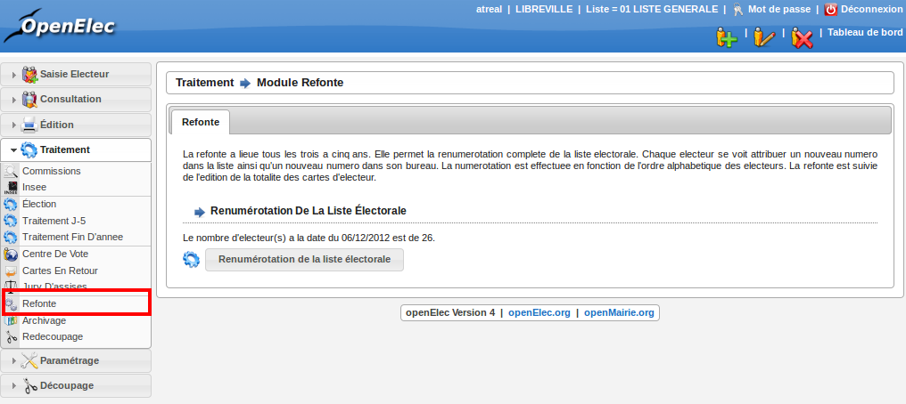
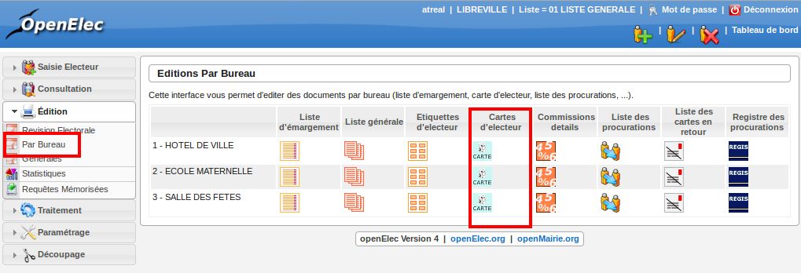

##############
Module Refonte
##############

La refonte a lieu tous les trois à cinq ans. Elle permet la renumérotation
complète de la liste électorale. Chaque électeur se voit attribuer un nouveau
numéro dans la liste ainsi qu'un nouveau numéro dans son bureau. La
numérotation est effectuée en fonction de l'ordre alphabétique des électeurs.
La refonte est suivie de l'édition de la totalité des cartes d'électeur.

Pour appliquer la refonte, il suffit de démarrer le traitement en cliquant
sur le bouton " Renumérotation de la liste électorale " et d'attendre que le
message de confirmation s'affiche.

    Ecran du module : Refonte

Pour imprimer les cartes d'électeurs, vous avez deux possibilités :

    * soit par le menu "Edition-Générales" (pensez à générer le fichier avant de l'éditer, en cliquant sur le bouton "générer")

.. figure:: module_traitement_edition_generale_cartes.png

    Ecran du module : Editions générales pour impression des cartes

    * soit par le menu "Edition-par bureau", ce qui vous permettra d'éditer les cartes par bureau de vote.

    Ecran du module : Editions par bureau pour impression des cartes
