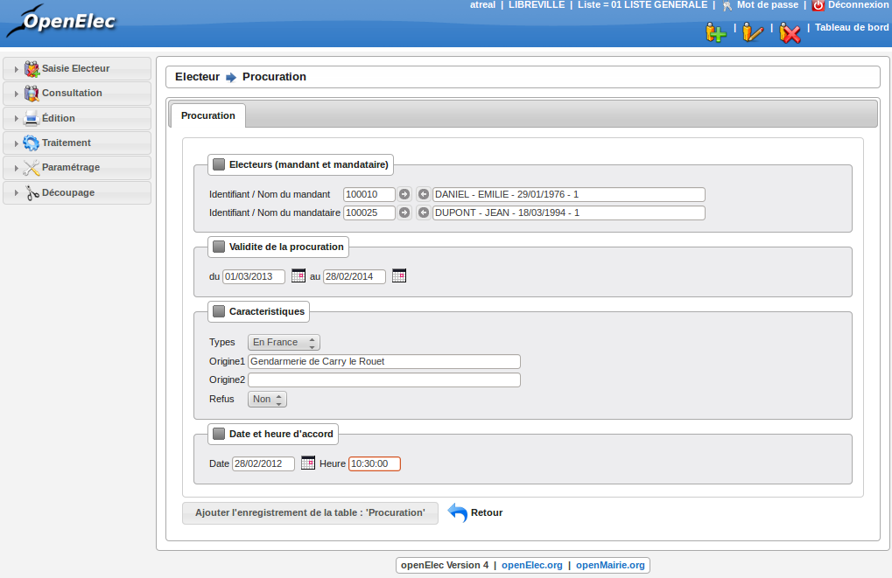

###########
Procuration
###########

Préambule
=========

Cet écran sert à gérer les procurations. Les procurations sont inscrites sur
la liste d’émargement par le traitement des procurations. La zone
procuration de la table électeur est mise à jour par le traitement.

Saisie des informations
=======================
.. note::

   Le formulaire de saisie de procuration comporte des zones de corrélations qui permettent de faire correspondre deux zones de saisies. La saisie du nom du mandataire, par exemple, permettra de retrouver son numéro d'électeur en cliquant sur la flèche de gauche.

    Saisie d'une procuration

Validation des informations
===========================

Une fois toutes les informations saisies, vous pouvez valider le
formulaire pour enregistrer la procuration.

Message de Vérification : Un mandant ne donne qu’une procuration pour une
même période. Un mandataire a au plus 2 mandats pour une même période dont
au moins un hors France. Un électeur en centre de vote ne peut pas donner
procuration. Des outils permettent de vérifier les procurations et de les
éditer. Ils se trouvent dans l’écran du menu « Traitement Procurations &
Mentions ».
