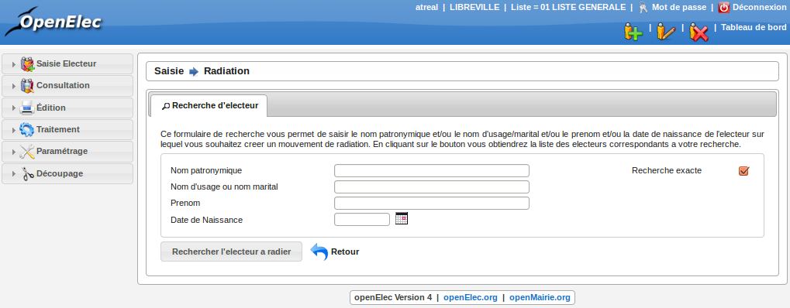
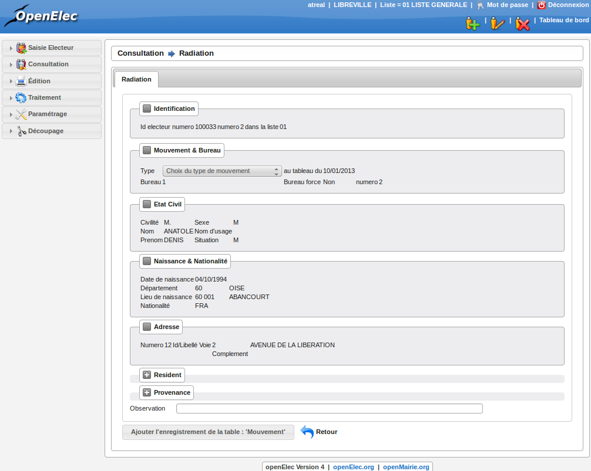

#########
Radiation
#########

Préambule
=========

Avant de procéder à une radiation, il faut vérifier que certains paramètres
sont correctement réglés :

* La date de tableau : il faut que cette date soit réglée à la date du prochain tableau, c'est-à-dire au prochain traitement du calendrier électoral (le 10/01/2014 ou le 28/02/2014).

* La liste en cours : il faut que la liste électorale en cours soit celle sur laquelle vous voulez travailler (01 liste générale, 02 liste européenne, 03 liste européenne municipale).

Recherche de l'électeur
=======================

En premier lieu, il faut réaliser une recherche de l'électeur. Un formulaire
permet de saisir le nom patronymique et/ou le nom d'usage/marital et/ou le
prenom et/ou la date de naissance de l'électeur que vous souhaitez radier.
Une fois que le résultat de la recherche s'affiche, vous pouvez voir une
croix rouge devant le nom de l'électeur. Il suffit de cliquer dessus pour
obtenir le formulaire de radiation.

    Recherche d'un électeur en vue d'une radiation

Saisie des informations
=======================

Le formulaire permet de saisir différentes informations sur l'électeur à
radier :

* Type de mouvement et bureau

Type : C'est le type de radiation, il faut sélectionner celui qui convient pour
que le mouvement possède les bons paramètres par exemple "décés", "départ
pour une autre commune", ...

* Divers

Observation : C'est une information sur la radiation de l'électeur.

Ce sont les deux seules possibilités de saisie, toutes les autres informations
sont là à titre indicatif.

Validation des informations
===========================

Une fois toutes les informations saisies, vous pouvez valider le formulaire
pour enregistrer la radiation. Une fois validé, le formulaire s'affiche à
nouveau avec des informations sur l'enregistrement tout en bas de la page.
Vérifiez bien que tout s'est déroulé correctement et cliquez sur le bouton
"Retour" (tout en bas du formulaire) pour consulter la liste des radiations
en cours.

Attention! Ce n'est pas parce que l'électeur est radié qu'il n'est plus
présent sur la liste électorale, il faut d'abord que la commision valide la
radiation pour que le traitement le supprime de la liste.

    Radiation d'un électeur
